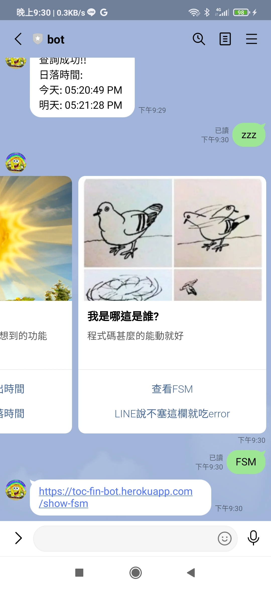

# TOC Project 2021

## 介紹
---
* 簡介：有臨時性的文字備忘錄和查詢臺灣日出落時間功能的line-bot
* line id：@762bmnoi
* FSM diagram：[來源](http://toc-fin-bot.herokuapp.com/show-fsm)


## 外部資源
---
* 程式碼範本來源：[來源](https://github.com/NCKU-CCS/TOC-Project-2020)
* 雲端server：[Heroku官網](https://dashboard.heroku.com)
* 雲端DB：[Redis Labs官網](https://redis.com)
* 日出落時間來源：[來源](https://sunrise.maplogs.com/zh-TW/taiwan.777.html)

## 各項功能用法
---
### 打開主選單
1. <font size=3>加好友</font>
	<br/>
2. <font size=3>發訊息或按按鈕</font>
	<br/>
	<br/>
	<br/>
	<br/>
	<br/>
---
### 增加代辦事項
1. <font size=3>點擊主選單的按鈕 (可略過)</font>
	<br/>
2. <font size=3>打指令並送出</font>
	<br/>
---
### 刪除代辦事項
1. <font size=3>點擊主選單的按鈕 (可略過)</font>
	<br/>
2. <font size=3>打指令並送出</font>
	<br/>
---
### 改動代辦事項
1. <font size=3>點擊主選單的按鈕 (可略過)</font>
	<br/>
2. <font size=3>打指令並送出</font>
	<br/>
---
### 查詢代辦事項
1. <font size=3>點擊主選單的按鈕 (可略過)</font>
	<br/>
2. <font size=3>打指令並送出</font>
	<br/>
---
### 查看日出時間
1. <font size=3>點擊主選單的按鈕或打指令</font>
	<br/>
---
### 查看日落時間
1. <font size=3>點擊主選單的按鈕或打指令</font>
	<br/>
---
### 查看FSM
1. <font size=3>點擊主選單的按鈕或打指令</font>
	<br/>
---

## 安裝
<details>
<summary><strong>原本README</strong></summary>

------

[](https://codeclimate.com/github/NCKU-CCS/TOC-Project-2020/maintainability)

[](https://snyk.io/test/github/NCKU-CCS/TOC-Project-2020)


Template Code for TOC Project 2020

A Line bot based on a finite state machine

More details in the [Slides](https://hackmd.io/@TTW/ToC-2019-Project#) and [FAQ](https://hackmd.io/s/B1Xw7E8kN)

## Setup

### Prerequisite
* Python 3.6
* Pipenv
* Facebook Page and App
* HTTPS Server

#### Install Dependency
```sh
pip3 install pipenv

pipenv --three

pipenv install

pipenv shell
```

* pygraphviz (For visualizing Finite State Machine)
    * [Setup pygraphviz on Ubuntu](http://www.jianshu.com/p/a3da7ecc5303)
	* [Note: macOS Install error](https://github.com/pygraphviz/pygraphviz/issues/100)


#### Secret Data
You should generate a `.env` file to set Environment Variables refer to our `.env.sample`.
`LINE_CHANNEL_SECRET` , `LINE_CHANNEL_ACCESS_TOKEN` , `PORT` , `HOST_NAME` , `DB_IP` , `DB_PORT` , `DB_PASSWORD`
* `LINE_CHANNEL_SECRET` , `LINE_CHANNEL_ACCESS_TOKEN`：line-bot的基本資訊
* `PORT`：在server提供line-bot的port
* `HOST_NAME`：提供line-bot服務的server的IP
* `DB_IP` , `DB_PORT` , `DB_PASSWORD`：連線至Redis資料庫所需的資訊<br>
**MUST** be set to proper values.
Otherwise, you might not be able to run your code.

#### Run Locally
You can either setup https server or using `ngrok` as a proxy.

#### a. Ngrok installation
* [ macOS, Windows, Linux](https://ngrok.com/download)

or you can use Homebrew (MAC)
```sh
brew cask install ngrok
```

**`ngrok` would be used in the following instruction**

```sh
ngrok http 8000
```

After that, `ngrok` would generate a https URL.

#### Run the sever

```sh
python3 app.py
```

#### b. Servo

Or You can use [servo](http://serveo.net/) to expose local servers to the internet.


## Finite State Machine


## Usage
The initial state is set to `user`.

Every time `user` state is triggered to `advance` to another state, it will `go_back` to `user` state after the bot replies corresponding message.

* user
	* Input: "go to state1"
		* Reply: "I'm entering state1"

	* Input: "go to state2"
		* Reply: "I'm entering state2"

## Deploy
Setting to deploy webhooks on Heroku.

### Heroku CLI installation

* [macOS, Windows](https://devcenter.heroku.com/articles/heroku-cli)

or you can use Homebrew (MAC)
```sh
brew tap heroku/brew && brew install heroku
```

or you can use Snap (Ubuntu 16+)
```sh
sudo snap install --classic heroku
```

### Connect to Heroku

1. Register Heroku: https://signup.heroku.com

2. Create Heroku project from website

3. CLI Login

	`heroku login`

### Upload project to Heroku

1. Add local project to Heroku project

	heroku git:remote -a {HEROKU_APP_NAME}

2. Upload project

	```
	git add .
	git commit -m "Add code"
	git push -f heroku master
	```

3. Set Environment - Line Messaging API Secret Keys

	```
	heroku config:set LINE_CHANNEL_SECRET=your_line_channel_secret
	heroku config:set LINE_CHANNEL_ACCESS_TOKEN=your_line_channel_access_token
	```

4. Your Project is now running on Heroku!

	url: `{HEROKU_APP_NAME}.herokuapp.com/callback`

	debug command: `heroku logs --tail --app {HEROKU_APP_NAME}`

5. If fail with `pygraphviz` install errors

	run commands below can solve the problems
	```
	heroku buildpacks:set heroku/python
	heroku buildpacks:add --index 1 heroku-community/apt
	```

	refference: https://hackmd.io/@ccw/B1Xw7E8kN?type=view#Q2-如何在-Heroku-使用-pygraphviz

## Reference
[Pipenv](https://medium.com/@chihsuan/pipenv-更簡單-更快速的-python-套件管理工具-135a47e504f4) ❤️ [@chihsuan](https://github.com/chihsuan)

[TOC-Project-2019](https://github.com/winonecheng/TOC-Project-2019) ❤️ [@winonecheng](https://github.com/winonecheng)

Flask Architecture ❤️ [@Sirius207](https://github.com/Sirius207)

[Line line-bot-sdk-python](https://github.com/line/line-bot-sdk-python/tree/master/examples/flask-echo)
</details>